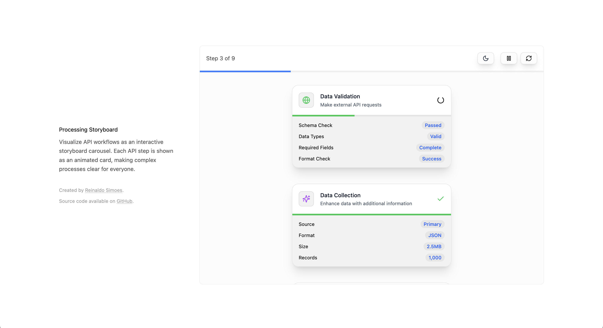

# Processing Storyboard — Interactive API Debugger

This repo re-imagines the API request/response lifecycle as an **interactive storyboard carousel**. It's designed to help **developers**, **designers**, and **non-technical stakeholders** quickly understand what happens between an API request and its response.



**Live demo:** https://processing-storyboard.vercel.app/

---

## 🧠 Purpose

This tool visualizes the step-by-step processing of an API call to:

- 🧩 **Distill complexity** into visual sequences
- 🎯 **Highlight hidden value** within each processing step
- 🌐 **Clarify for non-technical viewers** what's going on

Traditional list views lack clarity. They don't show how many steps exist, why something takes long, or how steps differ. This storyboard makes it intuitive — with cards, icons, color-coded operations, and latency-based animations.

---

## ✨ Features

- **3D Interactive Cards** – tilt based on cursor movement
- **Step-by-step Playback** – one card per step, with peekable depth
- **Progress Bars** – animated based on real latency data
- **Icons & Colors** – mapped to operation types (`validate`, `enrich`, `fraud`, etc.)
- **Completion Animations** – spinner turns into a checkmark
- **Dark/Light Mode** – toggle for theme preference
- **Smooth Transitions** – powered by spring-based animations

---

## 🧪 Usage Example

Here's how to use the `Processing` component with a set of steps:

```tsx
import Processing from "./components/Processing/Processing";

const steps = [
  {
    title: "Validate Account",
    type: "validate",
    payload: [
      { key: "status", value: "active" },
      { key: "balance", value: 1000 },
      { key: "currency", value: "USD" },
    ],
  },
  {
    title: "Enrich Customer Data",
    type: "enrich",
    payload: [
      { key: "risk_score", value: 0.8 },
      { key: "country", value: "US" },
      { key: "customer_since", value: "2023-01-15" },
    ],
  },
  // ...more steps
];

function App() {
  return <Processing steps={steps} />;
}
```

---

## 🛠 Tech Stack

| Category        | Stack                          |
| --------------- | ------------------------------ |
| Build & runtime | Vite • React 19 • TypeScript 5 |
| Styling & icons | Tailwind CSS 4 • lucide-react  |
| Animation       | Framer Motion 12               |
| Testing         | Vitest 3 • Testing Library     |

---

## 🎞 Animation Details

- **3D Card Effects** – perspective-based interaction
- **Spring Physics** – realistic, smooth transitions
- **Layout Shifts** – animated entry/exit with auto-layout
- **Progress Timing** – bars animate based on latency values
- **Theme Switching** – seamless dark/light transitions

---

## ♿ Accessibility

- Full keyboard navigation
- `role="list"` and accessible labels on each card
- Color contrast passes WCAG AA in both themes

---

## 🚀 Getting Started

```bash
# 1. Install dependencies
npm install

# 2. Start the dev server
npm run dev

# 3. Build for production
npm run build

# 4. Run tests
npm test

# Watch mode
npm test -- --watch
```

---

## 🤝 Contributing

We welcome contributions! Please see our [Contributing Guide](CONTRIBUTING.md) for details on how to submit pull requests, report issues, and suggest features.

## 🔒 Security

Please report any security vulnerabilities to us as described in our [Security Policy](SECURITY.md).

## 📝 License

This project is licensed under the MIT License - see the [LICENSE](LICENSE) file for details.

---

## 🌐 Deployment

Deployed via [Vercel](https://vercel.com/):

- Push to `main` → https://processing-storyboard.vercel.app
- Other branches → preview deployments
